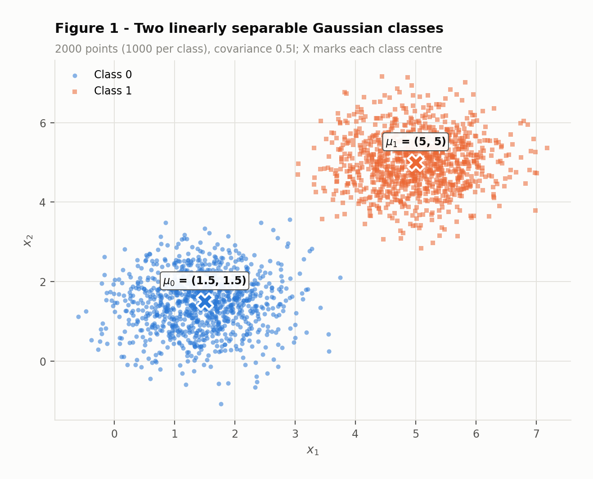
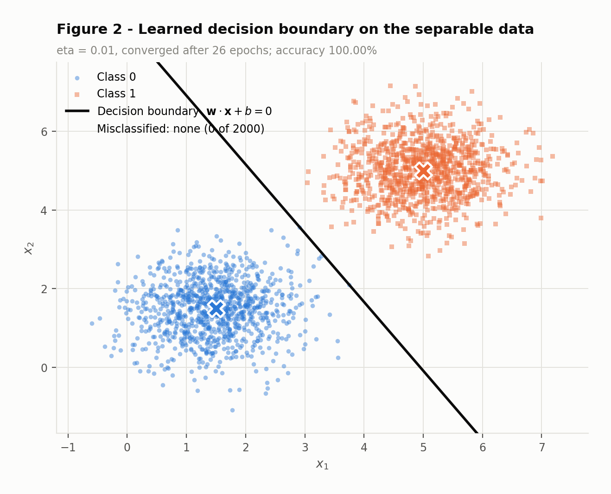
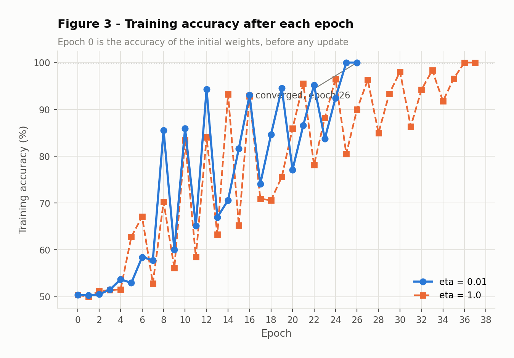
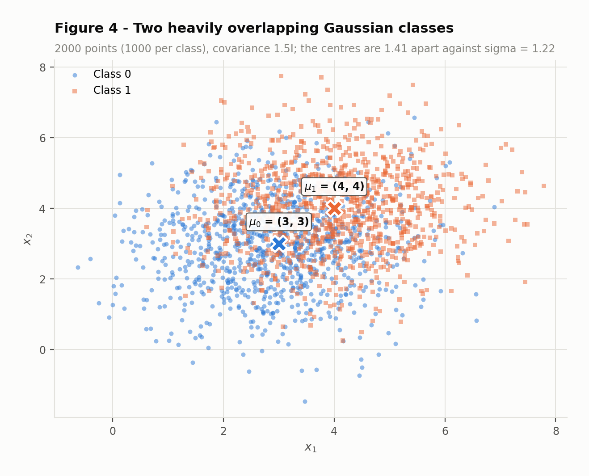
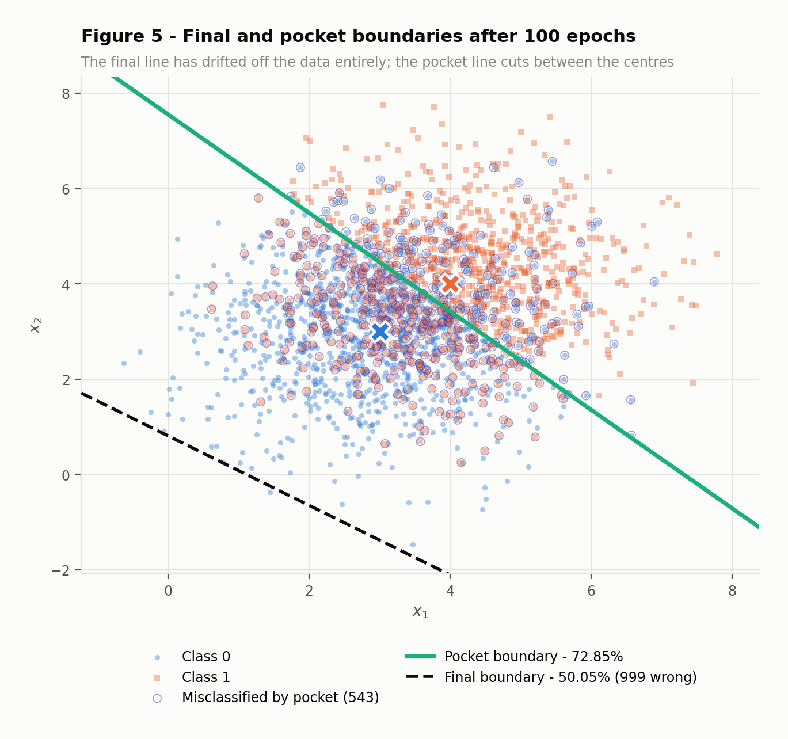
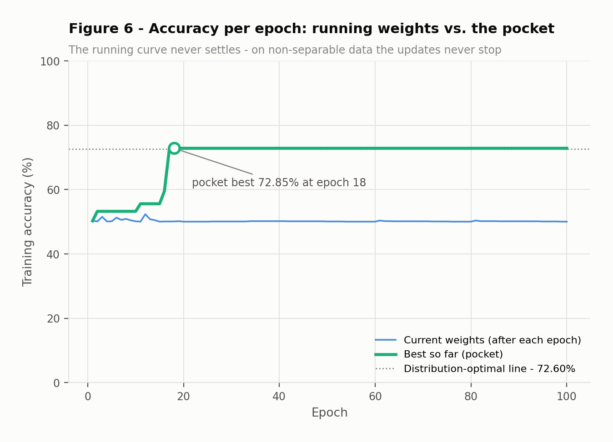
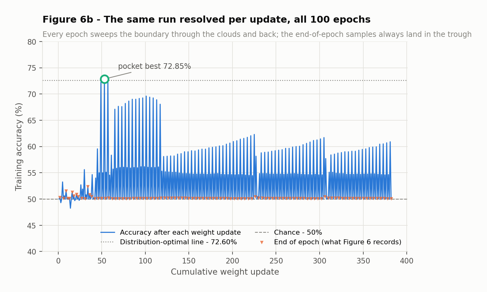

# Perceptron

The same short learning rule is run on two datasets. On the first it halts by itself with a perfect
score. On the second it never halts at all, and the weights it happens to be holding when the epoch
budget runs out are no better than a coin flip — while weights it passed through and discarded along
the way were close to the best any straight line can do. That gap is what the pocket algorithm is for.

Everything below is produced by two scripts and rendered from their JSON output, so no number in the
prose can drift from what the code computed. Seed `42` throughout.

|  | n | Exercise 1 mean | Exercise 1 cov | Exercise 2 mean | Exercise 2 cov |
| :--- | ---: | ---: | :--- | ---: | :--- |
| Class 0 | 1000 | (1.5, 1.5) | 0.5·I | (3, 3) | 1.5·I |
| Class 1 | 1000 | (5, 5) | 0.5·I | (4, 4) | 1.5·I |
| Centre distance | — | 4.9497 |  | 1.4142 |  |
| Per-axis σ | — | 0.7071 |  | 1.2247 |  |

## Exercise 1

Two spherical Gaussians, 1000 points each, far enough apart that no point of one class crosses into
the other.

### A — Generate the data

The centres are 4.9497 apart while each class has a per-axis σ of only
0.7071 — the centres are 7.0 standard deviations apart along the
line joining them, far enough that the clouds never touch.



**Figure 1.** The two classes. There is visible empty space between them: projected onto the direction
joining the centres, the nearest class-1 point sits 0.3856 above the farthest
class-0 point. A positive gap is exactly what linear separability means, and it is what the
convergence theorem needs.

### B — Implement the perceptron

The perceptron is written from scratch: nothing is imported beyond NumPy, and the step activation,
the update rule and the stopping test are all written out. Exercise 2 reuses this file completely
unchanged and only passes `pocket=True`.

| Setting | Value |
| :--- | :--- |
| Learning rate η | `0.01` (and `1.0` for the re-run in D) |
| Weight init | `rng.normal(0, 0.01, size=2)` → (0.002532, 0.008952) |
| Bias init | `0.0` |
| Activation | step — output `1` if `w·x + b ≥ 0`, else `0` |
| Update | `w += η(y − ŷ)x` and `b += η(y − ŷ)`, applied per sample |
| Stopping rule | a full epoch with zero updates, or 100 epochs |
| Seed | `np.random.default_rng(42)`, drawn in a fixed order |

Labels are `{0, 1}` rather than `{−1, +1}`, so the error term `y − ŷ` is `+1` when a class-1 point
was called 0, `−1` in the other direction, and `0` whenever the sample is already right. That last
case is the important one: **a correctly classified sample changes nothing**, which is what makes the
stopping rule meaningful.

```python
--8<-- "docs/exercises/perceptron/code/perceptron.py"
```

!!! note "One design decision worth stating"
    The samples are stacked class 0 first, class 1 second, and are **not** shuffled — the statement
    builds them that way. On separable data the order cannot affect the outcome. On overlapping data
    it very much affects *which* weights you end up holding, because every epoch ends right after a
    run of 1000 class-1 points. Exercise 2D takes that apart rather than hiding it.

    One consequence is that the pocket has to be scored after **every weight update**, which is
    Gallant's original formulation, not once per epoch. Scoring per epoch would only ever sample the
    bottom of the sawtooth in Figure 6b and would report a pocket of about 52% instead of
    72.85%.

### C — Train and measure

| Quantity | Value |
| :--- | ---: |
| Epochs to a zero-update pass | **26** |
| Final training accuracy | **100.00%** |
| Misclassified points | **0** |
| Weight updates in total | **73** |

The run ended on its own at epoch 26, not at the 100-epoch cap: that epoch produced no
updates at all, so every one of the 2000 points was on the correct side and there was nothing left to
change. The final state is **w** = (0.050497, 0.028872) and *b* = -0.2500.



**Figure 2.** The line `w·x + b = 0` for the final weights, drawn over the data. No point is marked as
misclassified because there are none — 100.00% of 2000. Note how close the line runs to the
class-0 cloud: the perceptron stops at the *first* hyperplane that happens to be consistent, and makes
no attempt to sit in the middle of the gap.



**Figure 3.** Accuracy after each epoch, for both learning rates. It is far from monotonic: each epoch
is measured right after the 1000 class-1 points, which repeatedly drag the boundary too far before the
next pass pulls it back. What matters is that the oscillation is damped — once the line lands inside
the gap it stays there, updates stop, and the run ends at epoch 26.

### D — Analysis

#### Why separable data converges quickly

Because the update is *error-driven*. The term `y − ŷ` is zero for every correctly classified sample,
so a correct point contributes nothing at all — not a small gradient, exactly nothing. Training
therefore consumes itself: each mistake rotates and shifts the boundary towards the offending point,
and once no point is left on the wrong side the algorithm is a fixed point of its own update rule.

The numbers make the scale of this concrete. Over 26 epochs the loop looked at
52,000 samples and changed the weights only 73 times —
0.14% of presentations. Nearly all the work was already done.

Novikoff's theorem is what turns that into a guarantee. Writing the model in augmented coordinates
`x̃ = [x, 1]` so the bias folds into the weight vector, if some unit-norm **w**\* classifies every
sample with margin at least γ and every `‖x̃‖ ≤ R`, then the total number of mistakes is at most
`(R / γ)²` — a bound that does not depend on how many samples there are, or on η. A valid witness here
is the hyperplane with the same normal as the centre line, offset to the middle of the empirical gap:

```text
R = 9.1736     γ* = 0.039567     →  mistakes ≤ (R / γ*)² = 53,753
observed: 73 mistakes
```

The bound is finite, which is the whole point — it guarantees termination. It is also extremely loose,
by about three orders of magnitude, and that looseness is honest rather than a bug: the augmented form
inflates `R` with an offset of roughly 5 while deflating γ, and the bound has to hold for the worst
possible ordering of the data. The qualitative claim it licenses is the one that matters: a wide gap
means a large γ, and a large γ means few mistakes.

It is worth noticing what the perceptron does *not* give you. The margin its own solution attains is
2.37e-04 — more than a hundred times smaller than the witness used to prove it would
terminate. It stops at the first consistent line, not the best one. That distinction is exactly what a
support vector machine exists to fix.

#### Re-running with η = 1.0

Same data, same starting weights, only η changed.

| Run | Final w | Final b | Epochs | Accuracy | ‖w‖ |
| :--- | ---: | ---: | ---: | ---: | ---: |
| η = 0.01, random init | (0.050497, 0.028872) | -0.2500 | 26 | 100.00% | 0.0582 |
| η = 1.0, random init | (5.8706, 3.3592) | -31.0000 | 37 | 100.00% | 6.7638 |
| η = 0.01, **zero** init | (0.058681, 0.033503) | -0.3100 | 37 | 100.00% | — |
| η = 1.0, **zero** init | (5.8681, 3.3503) | -31.0000 | 37 | 100.00% | — |

| Run | w / ‖w‖ | ‖w‖ |
| :--- | ---: | ---: |
| η = 0.01 | (0.868123, 0.496349) | 0.0582 |
| η = 1.0 | (0.867950, 0.496652) | 6.7638 |
| Angle between them | 0.0200° | — |
| Ratio of norms | 116.28× | — |

Both reach 100.00%. The weight *directions* are the same to within 0.0200°,
while the norms differ by a factor of 116. So η bought scale, not a different
classifier — multiplying **w** and *b* by any positive constant leaves the set `w·x + b = 0` untouched
and every prediction with it.

The one real difference is the epoch count: 26 at η = 0.01 against 37 at
η = 1.0. It would be easy to read that as "the small learning rate is faster", but the last two rows
of the table show it is nothing of the kind. Started from **w** = 0 both learning rates take exactly
37 epochs. The 26-epoch run is the odd one out, and the reason is the
*initialisation*, not the rate:

```text
‖w₀‖ = 0.009303     mean ‖x‖ = 4.6543

one update at η = 0.01 moves w by ≈ 0.0465
    — about 5× the initial weights, so w₀ still counts
one update at η = 1.0  moves w by ≈ 4.65
    — about 500×, so w₀ is immediately irrelevant
```

At η = 1.0 the initial weights are wiped out by the first update, so the run is indistinguishable from
starting at zero — and indeed it takes the same 37 epochs. At η = 0.01 the initial vector
is 0.20× the size of one update and survives long enough to matter; here it
happened to point somewhere useful and saved 11 epochs. That is luck,
not a property of the learning rate.

**So what does η control?** Only the scale of **w**, and through it the single ratio
`‖w₀‖ / (η·‖x‖)` — how quickly the updates drown out whatever the weights were initialised to. It does
not change the direction the weights converge to, the decision boundary, or the classification of any
point.

#### Why η cancels exactly when you start from zero

**Claim.** Run the algorithm twice on the same data in the same order, once with η₁ and once with η₂,
both from **w** = 0, *b* = 0. Then at every step **w**⁽²⁾ = *c* · **w**⁽¹⁾ and *b*⁽²⁾ = *c* · *b*⁽¹⁾,
with *c* = η₂/η₁ > 0.

*Proof by induction on the number of samples processed.*

**Base case.** Both runs start at **w** = 0 and *b* = 0, and 0 = *c* · 0 for any *c*. The relation
holds.

**Inductive step.** Suppose it holds before some sample **x**. The second run's activation is

```text
w⁽²⁾·x + b⁽²⁾ = c·w⁽¹⁾·x + c·b⁽¹⁾ = c (w⁽¹⁾·x + b⁽¹⁾)
```

Since *c* > 0, multiplying by *c* cannot change a sign, so `w⁽²⁾·x + b⁽²⁾ ≥ 0` exactly when
`w⁽¹⁾·x + b⁽¹⁾ ≥ 0`. Both runs therefore emit the **same prediction** ŷ, hence the same error
`e = y − ŷ`, and in particular they update on precisely the same samples. Applying the rule, and using
η₂ = *c*·η₁:

```text
w⁽²⁾ + η₂ e x = c·w⁽¹⁾ + c·η₁ e x = c (w⁽¹⁾ + η₁ e x)
b⁽²⁾ + η₂ e   = c·b⁽¹⁾ + c·η₁ e   = c (b⁽¹⁾ + η₁ e)
```

which is the relation again, one step later. By induction it holds for the entire run. ∎

Three consequences follow immediately. The two runs make **identical predictions at every step**, so
they misclassify the same samples in the same order and their accuracy curves are equal; the epoch on
which a pass first produces no updates is therefore the same, so the **epoch count is identical**; and
since `{x : c(w·x + b) = 0}` is the same set as `{x : w·x + b = 0}` for *c* > 0, the **decision
boundary is identical**. Only `‖w‖` differs, by the factor *c*.

The code checks this rather than asserting it. Running from zero at η = 0.01 and η = 1.0 gives weights
whose largest componentwise discrepancy from the predicted factor of 100 is
1.07e-14 — floating-point noise — with identical epoch counts (37
and 37) and, verified elementwise, identical accuracy curves.

!!! note "Which closes the loop on the previous question"
    The proof needs **w** = 0 as its base case. That is precisely why the statement asks for a non-zero
    initialisation: it breaks the scaling relation and makes η observable at all. What was measured
    above — 26 epochs versus 37 — is the size of that broken symmetry, and it
    vanishes the moment the initialisation does.

## Exercise 2

The same construction with the geometry inverted, so that no straight line can separate the classes.

### A — Generate the data

The centres move *closer*, from 4.95 apart to 1.4142,
while the spread *triples*, from σ = 0.7071 to 1.2247. Where Exercise 1 had its
centres 7.0 standard deviations apart, here they are only
1.15 — so the clouds do not merely touch, they sit almost on top of one another.



**Figure 4.** The overlapping classes. There is no empty corridor anywhere: any straight line has
points of both classes on both sides. The class centres are still distinguishable, which is why a
linear rule can do better than chance — but not much better.

### B — Train, keeping the best weights

The implementation from Exercise 1 is imported unchanged, with the same η = 0.01 and the same
100-epoch cap. The only addition is the pocket: a copy of the best weights seen so far, updated
whenever the running weights score higher on the full training set. The pocket never feeds back into
training — it only records.

| Weights | w | b | Accuracy | Misclassified |
| :--- | ---: | ---: | ---: | ---: |
| Final | (0.036057, 0.049421) | -0.0400 | 50.05% | 999 |
| Pocket | (0.006841, 0.006620) | -0.0500 | 72.85% | 543 |
| Bisector of the centres | (0.707107, 0.707107) | -4.9497 | 72.60% | 548 |

The bisector of the two centres is included as a reference: it is the Bayes-optimal linear rule *for
these distributions*, though on a finite sample another line can edge past it.

The run did not stop early: all 100 epochs executed, and the smallest number of updates in
any single epoch was 2, never zero. The pocket reached 72.85% at
epoch 18 and was never beaten in the 82 epochs that followed.

### C — Figures



**Figure 5.** Both boundaries on the data, with the points the pocket gets wrong circled. The pocket
line passes between the two centres, roughly where you would draw it by hand. The final line is not
near the data at all — it sits below everything, so it calls
100.0% of the set class 1 and scores 50.05%, which is chance.



**Figure 6.** The two required curves. The running accuracy never settles and never rises much above
50%; the pocket steps up whenever a better vector is seen and holds 72.85% from epoch
18 onwards. Compare the shape with Figure 3, which flattens and stops.

Figure 6 raises an obvious question: if the running weights hover at 50% for all 100 epochs, where did
the pocket's 72.85% come from? The answer is that once-per-epoch sampling hides the dynamics.



**Figure 6b.** The same run, resolved per weight update instead of per epoch. It is a sawtooth: within
every epoch the boundary sweeps up through the clouds — touching the linear ceiling near update
53 — and is then dragged back out by the class-1 block at the end of the pass. The orange
triangles mark the epoch boundaries, which is to say the points Figure 6 samples. They land in the
trough every single time.

### D — Analysis

#### Where the gap between final and pocket accuracy comes from

The proximate cause is that on non-separable data there is no fixed point. Updates never stop, so the
final weights are not a solution the algorithm settled on — they are just wherever it happened to be
standing when the epoch counter ran out. Since every epoch ends with 1000 consecutive class-1 samples,
that moment is systematically the worst one in the cycle.

The mechanism is in the relative size of the two updates. A mistake moves the weight vector by `ηx`
but the bias by only `η`:

```text
‖Δw‖ = η·‖x‖ ≈ 0.01 × 5.069 = 0.0507
|Δb|  = η                        = 0.0100

the normal vector travels about 5.1× faster than the offset,
because the clouds sit ‖x‖ ≈ 5 from the origin
```

That ratio is decisive, because the boundary's distance from the origin is `−b / ‖w‖`, and for the
line to pass through the clouds that quantity has to reach the projection of the cloud centre — about
4.9. The bias accumulates 5.1 times more slowly than `‖w‖` grows, so the ratio it can
sustain is of order 1, not of order 5:

| Weights | ‖w‖ | b | −b / ‖w‖ | Needed | Accuracy |
| :--- | ---: | ---: | ---: | ---: | ---: |
| Final | 0.061176 | -0.0400 | 0.6538 | 4.8903 | 50.05% |
| Pocket | 0.009520 | -0.0500 | 5.2521 | 4.9491 | 72.85% |

The final weights sit at 0.65 when they would need
4.89 — the line is nowhere near the data, which is why it labels essentially
everything class 1 and scores 50.05%. The pocket weights sit at
5.25 against a required 4.95, which is in range,
and score 72.85%. Notice how the pocket got there: its `‖w‖` is
6.4 times *smaller*, so the same small bias buys a much larger offset.
Those configurations are transient — the very next mistake inflates `‖w‖` again — which is precisely
why they have to be caught and stored as they go past. Of the 382 updates in the
run, only 40 ever exceeded 60% and
3 exceeded 70%.

So the 72.85% against 50.05% is not the pocket being clever. It is the pocket
keeping a receipt for a good moment that the algorithm itself has no way to recognise or hold on to.

#### Figure 3 against Figure 6, and what the theorem assumed

Figure 3 is a damped oscillation that terminates: the swings shrink, the curve reaches 100%, an epoch
passes with no updates, and training ends at epoch 26. Figure 6 is an undamped one that
does not: after 100 epochs the curve is still moving between 50.05% and
52.35%, and every epoch still produces updates. Nothing about it is converging, and
running it longer would not change that.

The perceptron convergence theorem requires two things:

1. **Bounded inputs** — some `R` with `‖x̃‖ ≤ R` for every sample. This dataset satisfies it
   comfortably; the norms are finite and small.
2. **Linear separability with a positive margin** — some **w**\* and γ > 0 with `ỹ(w*·x̃) ≥ γ` for
   *every* sample. **This is the assumption that fails.**

It fails structurally, not by accident of sampling. Two Gaussians have overlapping support: whatever
line you pick, both classes have probability mass on both sides of it. The optimal linear rule for
these two distributions — the perpendicular bisector of the centres, since the covariances are equal
and spherical — still misclassifies 548 of the 2000 points, for 72.60%
accuracy. The theoretical ceiling, from `Φ(d / 2σ)` with `d = 1.4142` and
`σ = 1.2247`, is 71.81%.

With no γ > 0 to speak of, `(R/γ)²` is unbounded. The theorem does not give a weaker guarantee in this
regime — it gives none, and the behaviour in Figure 6 is what "none" looks like. The algorithm keeps
finding mistakes because mistakes genuinely exist, and it is built to respond to every one of them.

The pocket's 72.85%, incidentally, is marginally *above* the bisector's
72.60%. That is not a contradiction: the bisector is optimal for the
distributions, while the pocket is chosen by looking at this particular finite sample, and 2000 points
leave room for that much slack.

#### Would more epochs, or a smaller η, fix it?

Neither, and the update rule says so without needing an experiment.

**More epochs.** The stopping rule fires when an epoch produces zero updates. An update fires on every
misclassified sample. Since the classes overlap, every possible weight vector misclassifies a positive
fraction of the data — even the best line found in this whole run still gets 543
of the 2000 wrong — so the number of mistakes per epoch is bounded below by a positive number that no
amount of training can reduce. A zero-update epoch is therefore unreachable, and the run is guaranteed
to exit on the cap at any budget. The evidence is already in the results: the smallest number of
updates in any of the 100 epochs was 2, and the pocket's best
arrived at epoch 18 and was not improved once in the 82 epochs after it.
More epochs buy more lottery tickets for the pocket, with diminishing returns. They do not buy
convergence.

**A smaller η.** The zero-initialisation proof in Exercise 1D is the complete answer. From a zero
initialisation, changing η rescales the entire weight trajectory by a positive constant and changes no
prediction anywhere — the boundary and the mistake sequence are literally identical. A learning rate
cannot fix non-convergence because it is not a parameter of the decision boundary at all; only
`w/‖w‖` and `b/‖w‖` are, and scaling every update by the same constant leaves both alone. With the
non-zero initialisation used here, shrinking η does one thing: it makes `w₀` relatively more important
for longer. That is a perturbation, not a cure, and it certainly cannot manufacture a separating
hyperplane that does not exist.

What would actually help is changing what is being optimised, not how fast:

- **Keep the pocket** — already done, and already at the linear ceiling: 72.85% against the
  72.60% of the distribution-optimal bisector leaves essentially nothing on the
  table.
- **Use a loss with a minimum** — logistic regression or a soft-margin SVM optimise a convex objective
  that stays finite on overlapping data, so they converge to a stable answer instead of oscillating.
  The perceptron rule has no such objective to descend.
- **Accept the floor, or change the features** — roughly 28.2% error
  is irreducible for *any* linear rule on these two distributions. Beating it needs a different
  hypothesis class, not a different optimiser.

!!! warning "On the sample ordering"
    Because the data is not shuffled, the 50.05% figure is partly an artefact of *when* we
    look: every epoch ends just after 1000 class-1 points. Shuffling would make the final weights land
    somewhere less systematically bad, and the final-versus-pocket gap would narrow. It would not
    change the conclusion. The run would still never converge, the accuracy would still oscillate
    rather than settle, and the pocket would still be necessary — because none of that depends on the
    order, only on the overlap.

## Results summary

| # | Quantity | Value |
| ---: | :--- | :--- |
| 1 | Exercise 1 — final weights **w** and bias *b* | **w** = (0.050497, 0.028872), *b* = -0.2500 |
| 2 | Exercise 1 — epochs to convergence | 26 (stopped on a zero-update epoch, not the 100-epoch cap) |
| 3 | Exercise 1 — final accuracy | 100.00% (2000 / 2000 correct) |
| 4 | Exercise 1 — epochs and accuracy with η = 1.0 | 37 epochs, 100.00% |
| 5 | Exercise 2 — final weights **w** and bias *b* | **w** = (0.036057, 0.049421), *b* = -0.0400 |
| 6 | Exercise 2 — accuracy of the final weights | 50.05% (999 / 2000 wrong) |
| 7 | Exercise 2 — accuracy of the pocket weights | 72.85% (543 / 2000 wrong) |
| 8 | Exercise 2 — epoch at which the pocket best occurred | epoch 18 (weight update 53 of 382) |

## Reproducing

Two scripts produce every figure and every number above; a third renders this page from their JSON
output. The seed is `42` and each script draws from its own generator in a fixed order, so the results
are identical between runs and each exercise can be run on its own.

```bash
git clone https://github.com/leosfreitas/ann-dl
cd ann-dl
pip install -r requirements.txt

cd docs/exercises/perceptron/code
python perceptron_ex1.py            # Figures 1, 2, 3      + results/perceptron1.json
python perceptron_ex2.py            # Figures 4, 5, 6, 6b  + results/perceptron2.json
python build_perceptron_report.py   # renders ../index.md
```

The perceptron itself is in `code/perceptron.py`, written from scratch — NumPy for array arithmetic
and the random generator, Matplotlib for the figures, and nothing else. No third-party model is
imported or trained anywhere in this exercise.

??? note "The analysis scripts in full"
    `perceptron_ex1.py` — data, training, the η comparison, the zero-init check, Figures 1–3.

```python
--8<-- "docs/exercises/perceptron/code/perceptron_ex1.py"
```

    `perceptron_ex2.py` — data, pocket training, the linear ceiling, Figures 4–6b.

```python
--8<-- "docs/exercises/perceptron/code/perceptron_ex2.py"
```
